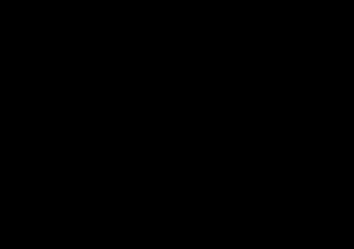
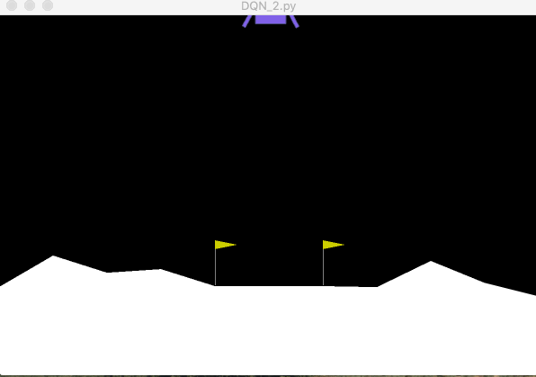
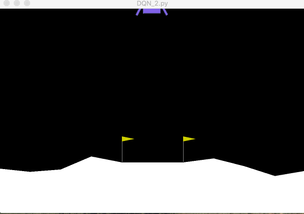

# Dannys-Lunar-Lander

## Overview

In this project, I chose to look at OpenAI's gym environment called LunarLander-v2 which simulates a very basic 2D spacecraft. The goal is to land the spacecraft in between the flags at an appropriate orientation and speed. In the spirit of the most recent unit, I looked into using a DQN to solve this and upon further research, I found out that it would be well suited for this problem. I used OpenAI's Gym to interact with the environment, Keras to create my model, and numpy for various computational tasks.

### Environment Setup
This agent is a Lunar spacecraft with 4 possible actions. It can either fire the right-facing thruster, the left-facing thruster, the bottom-facing thuster or no thruster at all. These actions correspond to the integers in the range 0-3 inclusive. We will call that the action space. The state space is a big larger and more involved. The state vector that is returned when we take an observation is of length 8 and follows the following format: [x_coord, y_coord, x_velocity, y_velocity, lander_angle, angular_velocity, isLeftLegDown, isRightLegDown]. At first I was intimidated by this vector and thought that there might have ben a lot of math involved, but reinforcement learning takes care of that for us. The end goal of this environment is to land on the ground below in between the two flags. The reward system is as follows. You get 100-140 points for moving from the top of the screen down to the ground, and points are lost if the lander moves up towards the sky again. If you land and come to rest, you get 100 points but if you crash, that is -100 points. Firing the main engine loses you 0.3 points per frame that it is fired so there is incentive to finish quickly, and 10 points are awarded for each leg making contact with the ground. 

### Model Setup
To begin, I recalled the lecture where we talked about DQN's. In order to solve the problem of correlated samples, a DQN uses a replay buffer to store information that it can sample from randomly. I created a class called ReplayBuffer that allowed me to store this information and create easily callable functions to add to and sample from it. 

Next, I used Keras to create a target neural network using the Sequential() model. The architecture of my network was influenced by my research but also somewhat of a guess and check. I settled on 4 hidden layers with an input dimension of 8 which represents an observation vector. Each hidden layer uses relu as it's activation function and the output layer has a linear activation function because I need to have multiple outputs. The output layer has an output dimension of size 4 because that is the size of the action space. I chose a learning rate of 0.001 as per the suggestion in previous lectures to keep it small in on the order of 0.001.

I also use a greedy-epsilon approach starting with an epsilon of 1 and decreasing the epsilon by a small amount each iteration. This works by randomly generating a number between 0 and 1. If the number is below epsilon, then I take a random sample of the action space and use that as my action. Otherwise, I use my network to predict an action and use that. This helps the model still explore even after it has been trained. 

### Training Procedure
In the training process, I let my model run 400 episodes and have a maximum iteration limit on each episode to avoid infinite hovering. The model begins with terrible performance and as is the way with reinforcement learning, it slowly begins to perform better. This model doesn't do particularly well until around 80-100 episodes. At this point, it begins to land more consistently and gets closeer to the desired landing pad. The model takes about 2 hours to run fully so it was a bit of a pain to test it because it is hard to tell if it is learning properly or not. 

### Troubleshooting
There has been PLENTY of troubleshooting! First, just getting the data formatted correctly took my some time. Initially in my replay buffer, I stored it as a 2D numpy array and that allowed for quick slicing and indexing when sampling. However, that gave me data dimension troubles that simply weren't worth the amount of spaghetti code necessary to fix them. So I reverted back to storing it as a list of lists which I then generate random indices for and then loop through my sample to get my desired numpy arrays of states, rewards, etc.

Additionally, in my training loop, I forgot to set my current state equal to the successor state at the end of my iteration which resulted in my rocket starting off random and learning to engage only the right or left engine. This caused the lander to begin doing flips the whole way down which, while that's pretty cool, it was not efficient nor the purpose of this exercise. It took my awhile to fix that because it was such a minor bug to notice in my code.

### Visualization

At the beginning of training, it is all random actions being chosen so we see behavior like this:  

As the lander acts like this and recieved large negative rewards, it learns that it shouldn't be doing this and weights are adjusted.

But later after about 200 episodes, we see the lander aiming itself and learning how to land. This is about as good as I got with my model.  

And after 300 episodes:  

### Conclusion and Results

It seems that my model did work, however I would love to experiment more with it. For instance, I believe that changing the architecture of the network would be interesting. Perhaps I would add or subtract a hidden layer as well as change the sizes of the hidden layers. I also would like to look into using Huber loss instead of MSE in my model because based on what I found online, it also seems like an appropriate loss function. 

My behavior took around 200 episodes to reall =y see success and I wonder what I could change that would allow me to see a faster convergence. I would also like to reimplement my ReplayBuffer with the Numpy 2D array, as I think that would speed up the training process at least with faster computation.

Overall, I think that this was an interesting project and I appreciate OpenAI's efforts to making reinforcement learning environments accessible. I learned a lot about RL in the process of completing this project and I hope to continue on with this project to learn even more.

## References

https://medium.com/@jonathan_hui/rl-dqn-deep-q-network-e207751f7ae4

https://towardsdatascience.com/solving-lunar-lander-openaigym-reinforcement-learning-785675066197 

https://github.com/openai/gym/blob/master/gym/envs/box2d/lunar_lander.py

https://becominghuman.ai/beat-atari-with-deep-reinforcement-learning-part-2-dqn-improvements-d3563f665a2c

https://github.com/shivaverma/OpenAIGym
